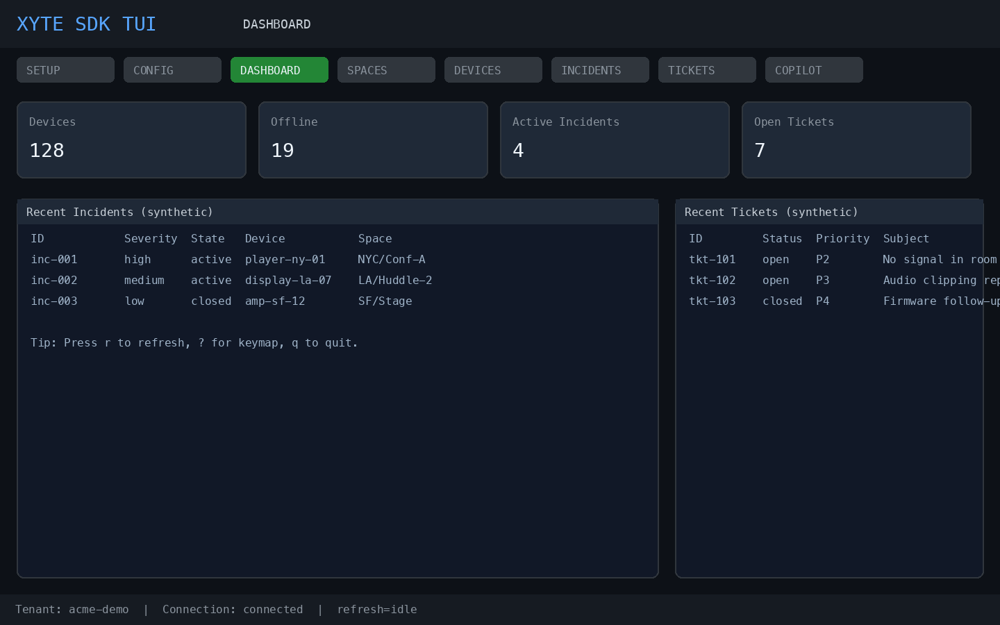
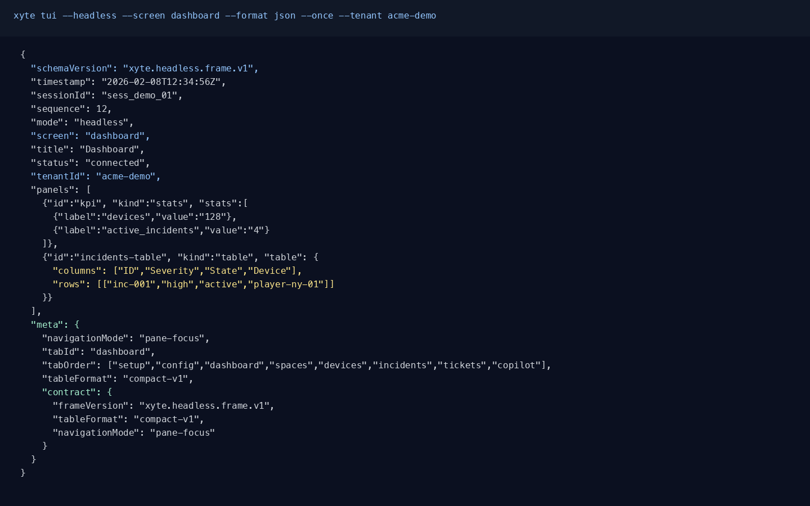

# xyte-cli

Xyte CLI with SKILLS, built for coding agents and operators.

`xyte-cli` provides deterministic access to Xyte APIs, a full TUI (without a Network tab), guarded write flows, headless NDJSON snapshots, and an MCP server.

### xyte-cli vs xyte MCP

- **CLI**: best fit for coding agents that need low-token, command-driven workflows.
- **MCP**: available for tool-based integrations and external orchestration via `xyte-cli mcp serve`.

### Key Features

- One-command skill install flow: `xyte-cli install --skills`
- Guided setup embedded into install flow (unless `--no-setup`)
- Provider/slot key lifecycle (`add`, `use`, `update`, `rename`, `test`, `remove`)
- Guarded endpoint writes (`--allow-write`) and deletes (`--confirm <endpoint-key>`)
- Full TUI screens:
  - `setup`, `config`, `dashboard`, `spaces`, `devices`, `incidents`, `tickets`
- Provider-first Config screen with hotkeys:
  - `a`, `e`, `u`, `t`, `x`, `n`, `c`, `r`
- Headless JSON frames with stable contracts
- Inspect/report pipelines with schema-versioned output
- Utility batch commands (rename/import) with dry-run default and `--apply` execution gate
- A4 PDF reports with humanized time labels, continuation-safe pagination, and readability-first table layout

## Requirements

- Node.js 18+
- A valid XYTE API key
- Writable local config directory (defaults to platform config path; override with `XYTE_CLI_CONFIG_DIR`)

## Getting Started

## Installation

```bash
npm install -g @xyteai/cli@latest
xyte-cli --help
```

### Install skills (recommended)

```bash
xyte-cli install --skills
```

By default, this command prompts for:
- install scope: `project`, `user`, or `both`
- agents: `all` or a subset of `claude,copilot,codex`

Then it installs the same skill bundle to the selected destinations and runs guided setup in the same flow.

When no prompt is available (CI/non-interactive), default is:
- scope: `project`
- agents: `all` (`claude`, `copilot`, `codex`)

Path mapping:
- Project scope:
  - Claude: `.claude/skills/xyte-cli`
  - Copilot: `.github/skills/xyte-cli`
  - Codex: `.agents/skills/xyte-cli`
- User scope:
  - Claude: `~/.claude/skills/xyte-cli`
  - Copilot: `~/.copilot/skills/xyte-cli`
  - Codex: `~/.agents/skills/xyte-cli`

Options:

```bash
xyte-cli install --skills --no-setup
xyte-cli install --skills --target /path/to/workspace
xyte-cli install --skills --scope project --agents claude,codex
xyte-cli install --skills --scope both --agents all --force
xyte-cli install --skills --force
```

### Non-interactive setup

```bash
XYTE_CLI_KEY="<your-key>" \
xyte-cli setup run --non-interactive --tenant acme
```

### Skills-less operation

Point your agent to `xyte-cli --help` and ask it to use CLI commands directly.

Example prompt:

```text
Use xyte-cli to inspect tenant acme and generate a PDF report.
Check xyte-cli --help first and keep outputs in JSON when possible.
```

## Visual Demo





## Commands

### Core

```bash
xyte-cli install --skills [--target <path>] [--scope <project|user|both>] [--agents <all|claude|copilot|codex[,..]>] [--force] [--no-setup]
xyte-cli doctor install --format json
xyte-cli setup status --tenant <tenant-id> --format json
xyte-cli setup run [--non-interactive] [--tenant <tenant-id>] [--key <value>]
xyte-cli config doctor --tenant <tenant-id> --format json
```

### Tenant + Auth Slots

```bash
xyte-cli tenant add <tenant-id> --name "Acme"
xyte-cli tenant use <tenant-id>
xyte-cli tenant list

xyte-cli auth key add --tenant <tenant-id> --provider xyte-org --name primary --key "<value>" --set-active
xyte-cli auth key list --tenant <tenant-id> --format json
xyte-cli auth key use --tenant <tenant-id> --provider xyte-org --slot primary
xyte-cli auth key update --tenant <tenant-id> --provider xyte-org --slot primary --key "<value>"
xyte-cli auth key rename --tenant <tenant-id> --provider xyte-org --slot primary --name prod-primary
xyte-cli auth key test --tenant <tenant-id> --provider xyte-org --slot prod-primary
xyte-cli auth key remove --tenant <tenant-id> --provider xyte-org --slot prod-primary --confirm
```

### Endpoint Operations

```bash
xyte-cli list-endpoints
xyte-cli describe-endpoint organization.devices.getDevices
xyte-cli call organization.devices.getDevices --tenant <tenant-id>
xyte-cli call organization.devices.getDevices --tenant <tenant-id> --output-mode envelope
```

### Guarded Writes

```bash
xyte-cli call organization.commands.sendCommand \
  --tenant <tenant-id> \
  --allow-write \
  --path-json '{"device_id":"DEVICE_ID"}' \
  --body-json '{"name":"reboot"}'

xyte-cli call organization.commands.cancelCommand \
  --tenant <tenant-id> \
  --allow-write \
  --confirm organization.commands.cancelCommand \
  --path-json '{"device_id":"DEVICE_ID","command_id":"COMMAND_ID"}'
```

### Utility Operations (Non-Device Scope)

All utility commands are dry-run by default. Add `--apply` to execute writes.
The same utility surface is available in MCP for parity (`xyte_device_bulk_rename`, `xyte_space_import_tree`).

```bash
# device rename with apply + per-row report
xyte-cli device bulk-rename \
  --tenant <tenant-id> \
  --input ./bulk-rename.csv \
  --apply \
  --report ./rename-report.ndjson

# space tree import (idempotent find-or-create)
xyte-cli space import-tree \
  --tenant <tenant-id> \
  --input ./space-import.csv \
  --apply
```

Input examples:

```csv
# bulk-rename.csv
device_id,new_name
d1,Camera A
d2,Camera B
```

```json
[
  { "device_id": "d1", "new_name": "Camera A" },
  { "device_id": "d2", "new_name": "Camera B" }
]
```

```json
{"path":"HQ","space_type":"site","config":{"zone":"root"}}
{"path":"HQ/Floor-1","space_type":"floor","config":{"zone":"north"}}
```

### Local Utility Sandbox

```bash
# terminal A
npm run mock:xyte:local -- --port 3001

# terminal B
npm run smoke:local:utilities -- --base-url http://127.0.0.1:3001 --tenant local
```

### AI-Assisted Utility Workflows (CLI-only execution)

`xyte-cli` has no embedded AI. AI is used only to preprocess messy input into canonical files, then CLI executes.

Operator contract docs:
- `/Users/porton/Projects/xyte-cli/docs/ai-utility-preprocessing.md`
- `/Users/porton/Projects/xyte-cli/scripts/templates/ai-bulk-rename.prompt.md`
- `/Users/porton/Projects/xyte-cli/scripts/templates/ai-space-import.prompt.md`
- entity node (devices): `/Users/porton/Projects/xyte-cli/skills/xyte-cli/references/utility-ai-device-bulk-rename.md`
- entity node (spaces): `/Users/porton/Projects/xyte-cli/skills/xyte-cli/references/utility-ai-space-import-tree.md`

Required AI output files:
- rename primary: `/Users/porton/Projects/xyte-cli/tmp/bulk-rename.csv` (`device_id,new_name`)
- rename rejects: `/Users/porton/Projects/xyte-cli/tmp/bulk-rename.rejected.csv` (+ `reject_reason`)
- rename notes: `/Users/porton/Projects/xyte-cli/tmp/bulk-rename.mapping.md`
- space primary: `/Users/porton/Projects/xyte-cli/tmp/space-import.jsonl` (`path`, optional `space_type`, optional `config`)
- space rejects: `/Users/porton/Projects/xyte-cli/tmp/space-import.rejected.jsonl` (+ `reject_reason`)
- space notes: `/Users/porton/Projects/xyte-cli/tmp/space-import.notes.md`

Step 1: build AI decoding context + scaffold files:

```bash
xyte-cli utility ai-context \
  --input /path/to/source-file \
  --entity devices \
  --tenant <tenant-id> \
  --output-dir /Users/porton/Projects/xyte-cli/tmp
```

Step 2: execute with existing utility commands.

Production runbook:

```bash
# rename dry-run
xyte-cli device bulk-rename \
  --tenant <tenant-id> \
  --input /Users/porton/Projects/xyte-cli/tmp/bulk-rename.csv \
  --report /Users/porton/Projects/xyte-cli/tmp/bulk-rename.dryrun.ndjson

# rename apply
xyte-cli device bulk-rename \
  --tenant <tenant-id> \
  --input /Users/porton/Projects/xyte-cli/tmp/bulk-rename.csv \
  --apply \
  --report /Users/porton/Projects/xyte-cli/tmp/bulk-rename.apply.ndjson

# space import dry-run
xyte-cli space import-tree \
  --tenant <tenant-id> \
  --input /Users/porton/Projects/xyte-cli/tmp/space-import.jsonl \
  --report /Users/porton/Projects/xyte-cli/tmp/space-import.dryrun.ndjson

# space import apply
xyte-cli space import-tree \
  --tenant <tenant-id> \
  --input /Users/porton/Projects/xyte-cli/tmp/space-import.jsonl \
  --apply \
  --report /Users/porton/Projects/xyte-cli/tmp/space-import.apply.ndjson
```

Verification examples:

```bash
xyte-cli call organization.devices.getDevice \
  --tenant <tenant-id> \
  --path-json '{"device_id":"<sample-device-id>"}'

xyte-cli call organization.spaces.getSpaces \
  --tenant <tenant-id> \
  --query-json '{"path_includes":"HQ/Floor-1/Room-A"}'
```

### Insights + Reports

```bash
xyte-cli inspect fleet --tenant <tenant-id> --format json
xyte-cli inspect deep-dive --tenant <tenant-id> --window 24 --format json > /tmp/deep-dive.json
xyte-cli report generate --tenant <tenant-id> --input /tmp/deep-dive.json --out /tmp/xyte-report.pdf
```

### TUI + Headless

```bash
xyte-cli tui
xyte-cli tui --headless --screen dashboard --format json --once --tenant <tenant-id>
xyte-cli tui --headless --screen spaces --format json --follow --interval-ms 2000 --tenant <tenant-id>
```

### MCP

```bash
xyte-cli mcp serve
```

Utility parity in MCP:
- `xyte_device_bulk_rename`
- `xyte_space_import_tree`
- `xyte_utility_ai_context`

## Headless Contract IDs

- `xyte.headless.frame.v1`
- `xyte.call.envelope.v1`
- `xyte.inspect.fleet.v1`
- `xyte.inspect.deep-dive.v1`
- `xyte.report.v1`
- `xyte.utility.batch.v1`
- `xyte.utility.ai-context.v1`

Schemas:

- `docs/schemas/headless-frame.v1.schema.json`
- `docs/schemas/call-envelope.v1.schema.json`
- `docs/schemas/inspect-fleet.v1.schema.json`
- `docs/schemas/inspect-deep-dive.v1.schema.json`
- `docs/schemas/report.v1.schema.json`
- `docs/schemas/utility-batch.v1.schema.json`
- `docs/schemas/utility-ai-context.v1.schema.json`

## Agent Quick Start

### Claude

```bash
xyte-cli install --skills
claude
```

### Codex

```bash
xyte-cli install --skills
# in Codex prompts, ask to run xyte-cli commands directly
```

### GitHub Copilot

```bash
xyte-cli install --skills
# in Copilot prompts, ask to run xyte-cli commands directly
```

## Development

```bash
npm ci
npm run typecheck
npm test
npm run build
npm pack
```

Local package smoke:

```bash
npm i -g ./xyte-cli-*.tgz
xyte-cli install --skills --no-setup
```

External user live smoke (required before commit):

```bash
XYTE_CLI_KEY="<real-key>" \
XYTE_E2E_TENANT="<tenant-id-or-default>" \
npm run test:commit
```

This gate is enforced before commit:
`npm run test:commit` runs `npm run typecheck`, `npm test`, `npm run check:endpoint-parity`, then `npm run smoke:external-live`.

`smoke:external-live` runs exactly like a new external user install:
1. `npm pack`
2. isolated HOME/config/prefix/workspace
3. global install from tarball
4. `xyte-cli doctor install --format json`
5. `xyte-cli install --skills --scope both --agents all --force --no-setup` (plus skill manifest/actionability assertion)
6. one-time `xyte-cli setup run --non-interactive --tenant <tenant> --key <real-key>`
7. `xyte-cli setup status --tenant <tenant> --format json` must be `ready`
8. real read endpoint call: `xyte-cli call organization.devices.getDevices --tenant <tenant> --output-mode envelope --strict-json`

If `XYTE_E2E_TENANT` is omitted, `default` is used.
If `XYTE_CLI_KEY` is missing, the smoke step fails before any install call executes.

## Release

Manual npm release steps are documented in:

- `docs/release.md`

## Skill Package Layout

- `skills/xyte-cli/SKILL.md`
- `skills/xyte-cli/references/`
- `skills/xyte-cli/scripts/`
- `skills/xyte-cli/agents/`
